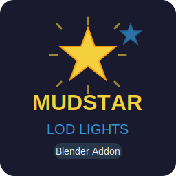

# MUDSTAR LOD Lights



A Blender addon for editing and generating LOD (Level of Detail) lights for GTA V.

## Description

MUDSTAR LOD Lights is a Blender addon that allows users to edit LOD lights and automatically generate distant LOD lights at export. This tool is specifically designed for GTA V modding workflows, making it easier to manage lighting in your custom maps and models.

## Features

- **LOD Light Editor**: Edit properties of LOD lights directly in Blender
- **Automatic Generation**: Generate distant LOD lights from existing lights
- **GTA V Compatible**: Designed specifically for GTA V modding workflow
- **Easy Export**: Export LOD lights data with a single click
- **Intuitive UI**: Simple sidebar panel in Blender's 3D viewport

## Installation

1. Download the latest release or clone this repository
2. In Blender, go to `Edit > Preferences > Add-ons`
3. Click `Install` and select the `py/__init__.py` file
4. Enable the "MUDSTAR LOD Lights" addon from the list
5. The addon panel will appear in the 3D View sidebar under the "MUDSTAR" tab

## Usage

1. Select a light object in your scene
2. Open the sidebar (press `N` in the 3D viewport)
3. Navigate to the "MUDSTAR" tab
4. Configure LOD light settings:
   - **Enable LOD Light**: Toggle LOD generation for this light
   - **Intensity**: Set the light intensity for LOD
   - **Color**: Choose the light color
   - **LOD Distance**: Set the distance at which LOD light becomes visible
5. Click "Generate LOD Lights" to create LOD versions of selected lights
6. Use "Export LOD Lights" to export your LOD lights data

## Requirements

- Blender 2.80 or higher
- Python 3.7+

## File Structure

```
MUDSTAR-LODLIGHTS/
├── py/                      # Python addon source code
│   └── __init__.py         # Main addon file
├── mudstar_lodlights.svg   # Addon logo
├── LICENSE                 # MIT License
├── README.md              # This file
└── .gitignore            # Git ignore rules
```

## License

This project is licensed under the MIT License - see the [LICENSE](LICENSE) file for details.

## Contributing

Contributions are welcome! Please feel free to submit a Pull Request.

## Support

If you encounter any issues or have questions, please open an issue on the GitHub repository.

## Credits

Developed by MouMoud-dev

---

**Note**: This addon is designed for GTA V modding purposes. Make sure you comply with all relevant terms of service and licensing agreements when modding games.
